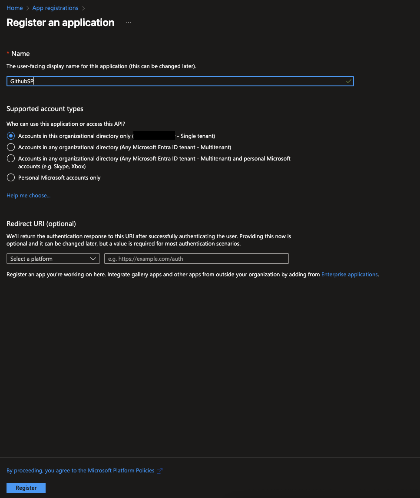
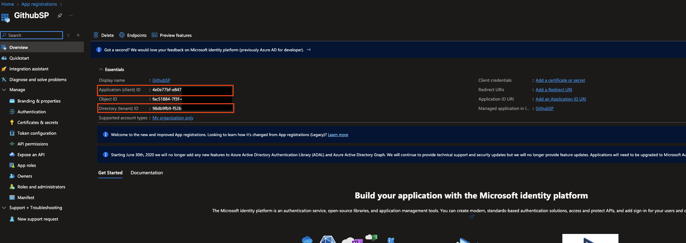
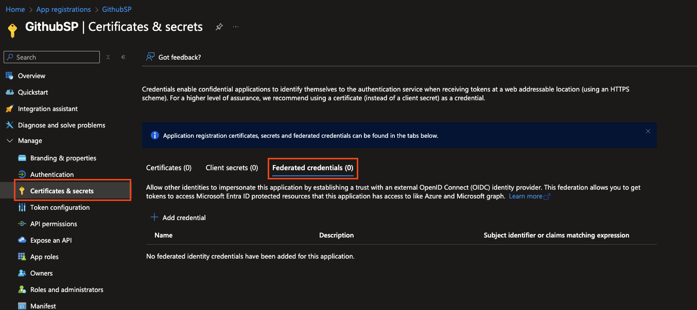
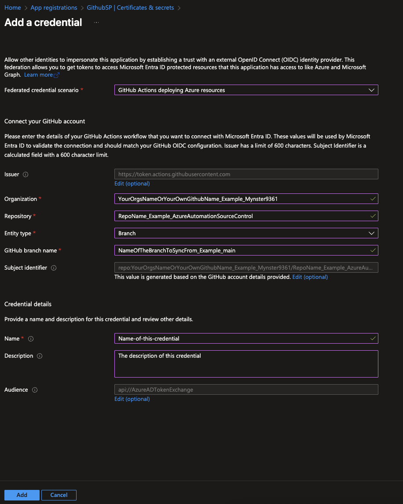
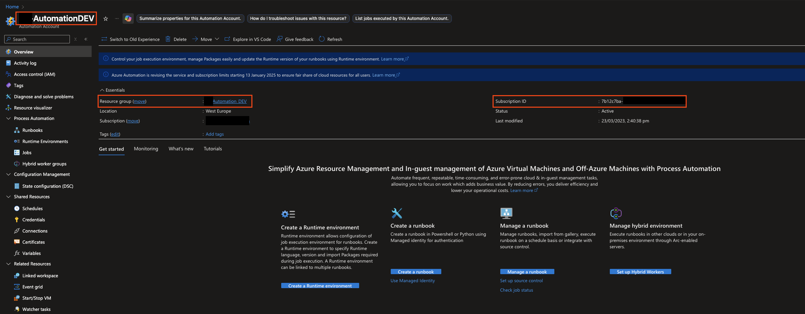

# Azure Automation Source Control

This GitHub Action synchronizes your repository files with Azure Automation runbooks. It automatically detects added, modified, and deleted files and performs the corresponding operations in your Azure Automation account.

## Features

- 🔄 **Two-way sync** - Updates Azure Automation runbooks from your repo and cleans up deleted files
- 🔍 **Smart detection** - Automatically identifies runbook types based on file content and extensions
- 📂 **Path filtering** - Process all files or limit to specific directories
- 🚫 **Exclusion support** - Skip specific files or folders from processing
- 🛡️ **Conflict detection** - Identifies naming conflicts before processing files

## Prerequisites

Before using this action, you need:

1. **Azure Automation Account** - An existing Automation Account in your subscription
2. **Azure Service Principal** - With appropriate permissions to manage Automation Accounts
3. **GitHub Secrets** - To store your Azure credentials securely

## Setup

### 1. Create Azure Service Principal

Create a service principal with Contributor access to your Automation Account along with federated credentials to your repo:

#### Setup your app







**Assign RBAC permissions to the above app on your Automation Account**

### 2. Store GitHub Secrets

Add the following secrets to your GitHub repository:

- AZURE_CLIENT_ID - Service principal client ID
- AZURE_TENANT_ID - Azure tenant ID
- AZURE_SUBSCRIPTION_ID - Azure subscription ID
- AZURE_RESOURCE_GROUP - Resource group name
- AZURE_AUTOMATION_ACCOUNT - Automation account name

### 3. Create a Workflow

Create a workflow file in your repository at .github/workflows/sync-runbooks.yml:

```yml
name: Sync Azure Automation Runbooks

on:
  push:
    branches: [ main ]
  pull_request:
    branches: [ main ]
  workflow_dispatch:
    inputs:
      path_filter:
        description: 'Path to process (e.g., "runbooks/" or "." for all)'
        default: '.'
      validate_all:
        description: 'Process all files, not just changed ones'
        type: boolean
        default: false

permissions:
  contents: read
  id-token: write

jobs:
  sync:
    runs-on: ubuntu-latest
    permissions:
      id-token: write
      contents: read

    steps:
    - name: Checkout repository
      uses: actions/checkout@v5
      with:
        fetch-depth: 0  # Important for proper git history

    - name: Azure Login
      uses: azure/login@v2
      with:
        client-id: ${{ secrets.AZURE_CLIENT_ID }}
        tenant-id: ${{ secrets.AZURE_TENANT_ID }}
        subscription-id: ${{ secrets.AZURE_SUBSCRIPTION_ID }}

    - name: Sync Azure Automation Runbooks
      uses: Mynster9361/azure-automation-source-control@v1
      with:
        subscription_id: ${{ secrets.AZURE_SUBSCRIPTION_ID }}
        resource_group: ${{ secrets.AZURE_RESOURCE_GROUP }}
        automation_account: ${{ secrets.AZURE_AUTOMATION_ACCOUNT }}
        path_filter: ${{ github.event.inputs.path_filter || '.' }}
        validate_all: ${{ github.event.inputs.validate_all || false }}
```

## Usage

**Basic Usage**

Once set up, the action will run automatically on push to the main branch or when manually triggered.

## Configuration Options

| Input                | Description                                              | Default                                   |
| -------------------- | -------------------------------------------------------- | ----------------------------------------- |
| subscription_id      | Azure subscription ID                                    | Required                                  |
| resource_group       | Resource group containing the Automation Account         | Required                                  |
| automation_account   | Name of the Automation Account                           | Required                                  |
| path_filter          | Path to process (e.g., "runbooks/" or "." for all files) | .                                         |
| recursive            | Process files recursively within the path_filter         | true                                      |
| exclude_paths        | Comma-separated list of paths to exclude                 | .github/,.vscode/,docs/,README.md,LICENSE |
| validate_all         | Process all files rather than just changed ones          | false                                     |
| added_modified_files | Space-separated list of added/modified files (optional)  | Auto-detected                             |
| deleted_files        | Space-separated list of deleted files (optional)         | Auto-detected                             |

**Manual Triggering**

You can manually trigger the workflow from the Actions tab in your repository. When triggered manually, you can specify:

- A custom path filter
- Whether to process all files or just changed ones

**Runbook Type Detection**

The action automatically detects the runbook type based on file extension and content:

- .ps1 files: PowerShell, PowerShellWorkflow, etc. (based on content hints)
- .py files: Python2 or Python3 (based on content hints)

Add type hints in your files for more precise detection:

**PowerShell**

```powershell
# PowerShellWorkflow
workflow My-Workflow {
    # Workflow code
}
```

**Python**

```python
#!/usr/bin/env python3
# Your Python 3 code
```

## Examples

### Process Only Files in a Specific Directory

```yml
- uses: Mynster9361/azure-automation-source-control@v1
  with:
    subscription_id: ${{ secrets.AZURE_SUBSCRIPTION_ID }}
    resource_group: ${{ secrets.AZURE_RESOURCE_GROUP }}
    automation_account: ${{ secrets.AZURE_AUTOMATION_ACCOUNT }}
    path_filter: 'runbooks/'
```

### Exclude Specific Files

```yml
- uses: Mynster9361/azure-automation-source-control@v1
  with:
    subscription_id: ${{ secrets.AZURE_SUBSCRIPTION_ID }}
    resource_group: ${{ secrets.AZURE_RESOURCE_GROUP }}
    automation_account: ${{ secrets.AZURE_AUTOMATION_ACCOUNT }}
    exclude_paths: '.github/,.vscode/,docs/,test/,*.md'
```

### Process All Files (Not Just Changed Ones)

```yml
- uses: Mynster9361/azure-automation-source-control@v1
  with:
    subscription_id: ${{ secrets.AZURE_SUBSCRIPTION_ID }}
    resource_group: ${{ secrets.AZURE_RESOURCE_GROUP }}
    automation_account: ${{ secrets.AZURE_AUTOMATION_ACCOUNT }}
    validate_all: true
```

### Process Only Top-Level Files in a Directory (Non-Recursive)

```yml
- uses: Mynster9361/azure-automation-source-control@v1
  with:
    subscription_id: ${{ secrets.AZURE_SUBSCRIPTION_ID }}
    resource_group: ${{ secrets.AZURE_RESOURCE_GROUP }}
    automation_account: ${{ secrets.AZURE_AUTOMATION_ACCOUNT }}
    path_filter: 'runbooks/'
    recursive: false
```

# Known issues

## Your scripts can not include a space in the naming

Due to some limitations in the GitHub workflow and detecting changes on multiple files the seperation charactere is a space.
So instead of naming your file "Get Some.ps1" use "Get-Some.ps1" then it will pick up the file correctly if you do not do this then it will consider "Get Some.ps1" to be 2 seperate files one called "Get" with no file extension and one called "Some.ps1" which will then be created in Azure Automation
